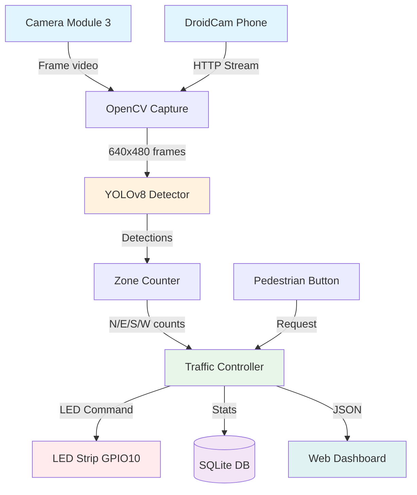
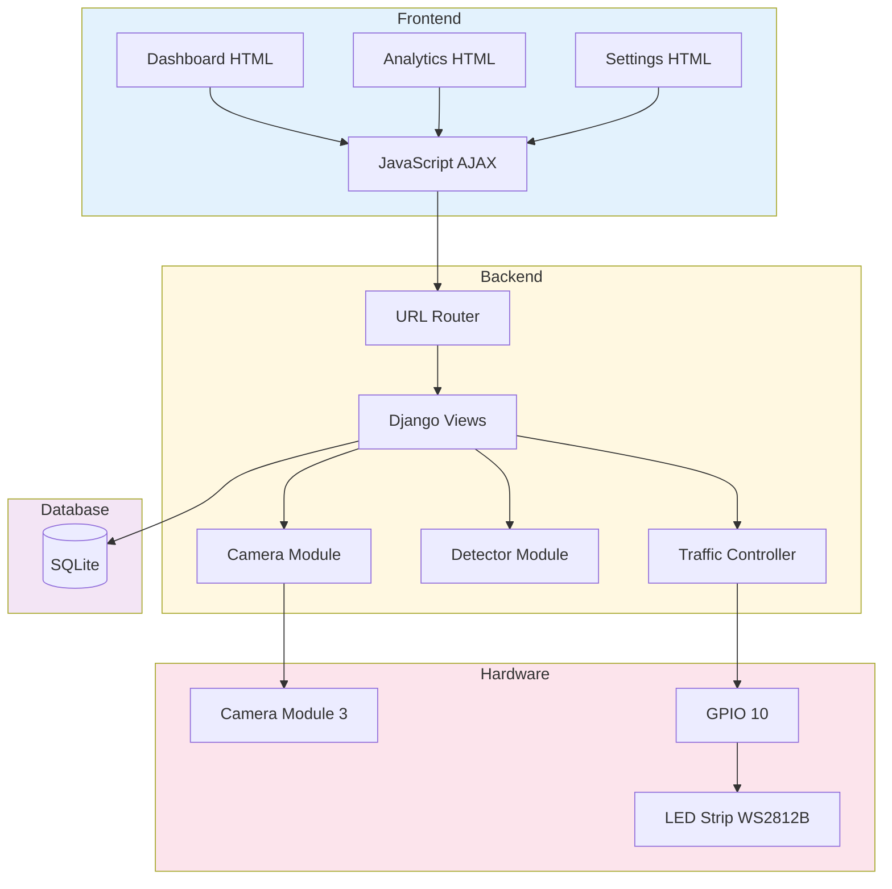

# 🚦 Smart Traffic Light System - Documentație Completă

## Cuprins
1. [Descriere Generală](#descriere-generală)
2. [Arhitectura Sistemului](#arhitectura-sistemului)
3. [Schema Bloc Hardware](#schema-bloc-hardware)
4. [Schema Bloc Software](#schema-bloc-software)
5. [Schema Bloc Finală](#schema-bloc-finală)
6. [Module Software](#module-software)
7. [Fluxul de Date](#fluxul-de-date)
8. [Algoritmi Implementați](#algoritmi-implementați)
9. [Funcționalități Implementate](#funcționalități-implementate)
10. [Funcționalități Propuse pentru Viitor](#funcționalități-propuse-pentru-viitor)

---

## Descriere Generală

Sistemul **Smart Traffic Light** este un sistem inteligent de control al semaforului bazat pe detectarea vehiculelor în timp real folosind viziune computerizată și inteligență artificială. Sistemul rulează pe **Raspberry Pi 5** și utilizează **Camera Module 3** pentru captura video, **YOLOv8-nano** pentru detectarea obiectelor și o **bandă LED NeoPixel** pentru afișarea stării semaforului.

### Caracteristici Principale:
- Detecție în timp real a vehiculelor folosind AI (YOLOv8)
- Control adaptiv al semaforului bazat pe densitatea traficului
- Suport pentru cameră secundară (DroidCam - telefon mobil)
- Mod Pedestrian Phone - detectare vehicule de pe telefon pentru traversare
- Interfață web responsive pentru monitorizare și control
- Analiză și predicție trafic cu date istorice
- Integrare cu date meteo

---

## Arhitectura Sistemului

### Componente Hardware:
| Componentă            | Descriere                                  |
| --------------------- | ------------------------------------------ |
| Raspberry Pi 5        | Unitatea centrală de procesare             |
| Camera Module 3       | Cameră principală pentru detecție vehicule |
| LED Strip WS2812B     | Bandă LED 8 pixeli pentru afișare semafor  |
| Smartphone (opțional) | Cameră secundară via DroidCam              |

### Componente Software:
| Componentă   | Tehnologie                |
| ------------ | ------------------------- |
| Backend      | Django 5.2 (Python)       |
| AI/ML        | YOLOv8-nano (Ultralytics) |
| Frontend     | HTML5, CSS3, JavaScript   |
| Bază de Date | SQLite                    |
| LED Control  | rpi_ws281x (NeoPixel)     |

---

## Schema Bloc Hardware

```
┌─────────────────────────────────────────────────────────────────────────────┐
│                           SCHEMA BLOC HARDWARE                               │
└─────────────────────────────────────────────────────────────────────────────┘

    ┌──────────────────┐         ┌──────────────────┐
    │   CAMERA         │         │   SMARTPHONE     │
    │   MODULE 3       │         │   (DroidCam)     │
    │                  │         │                  │
    │  • 12MP Sensor   │         │  • WiFi Stream   │
    │  • CSI Interface │         │  • HTTP Video    │
    └────────┬─────────┘         └────────┬─────────┘
             │                            │
             │ CSI Ribbon Cable           │ WiFi (HTTP)
             │                            │
             ▼                            ▼
    ┌─────────────────────────────────────────────────┐
    │                                                 │
    │              RASPBERRY PI 5                     │
    │                                                 │
    │  ┌─────────────┐    ┌─────────────────────┐    │
    │  │ CSI Port    │    │ WiFi Module         │    │
    │  │ (Camera In) │    │ (Network Interface) │    │
    │  └──────┬──────┘    └──────────┬──────────┘    │
    │         │                      │               │
    │         ▼                      ▼               │
    │  ┌──────────────────────────────────────┐     │
    │  │         CPU + GPU Processing         │     │
    │  │                                      │     │
    │  │  • Video Capture (libcamera/OpenCV)  │     │
    │  │  • YOLOv8 Detection (AI)             │     │
    │  │  • Traffic Logic                     │     │
    │  │  • Django Web Server                 │     │
    │  └──────────────────────────────────────┘     │
    │                    │                          │
    │                    ▼                          │
    │  ┌──────────────────────────────────────┐     │
    │  │           GPIO 10 (SPI MOSI)         │     │
    │  │           PWM Data Signal            │     │
    │  └──────────────────────────────────────┘     │
    │                                                │
    └────────────────────┬────────────────────────────┘
                         │
                         │ Data Signal (800kHz PWM)
                         │
                         ▼
    ┌─────────────────────────────────────────────────┐
    │                                                 │
    │           LED STRIP WS2812B (8 LED)             │
    │                                                 │
    │   ┌─────┬─────┬─────┬─────┬─────┬─────┬─────┬─────┐
    │   │ LED │ LED │ LED │ YEL │ YEL │ GRN │ GRN │ GRN │
    │   │ RED │ RED │ RED │ LOW │ LOW │     │     │     │
    │   │  0  │  1  │  2  │  3  │  4  │  5  │  6  │  7  │
    │   └─────┴─────┴─────┴─────┴─────┴─────┴─────┴─────┘
    │                                                 │
    │   Alimentare: 5V DC, GND comun cu RPi           │
    │                                                 │
    └─────────────────────────────────────────────────┘

                         │
                         ▼
    ┌─────────────────────────────────────────────────┐
    │              BROWSER (CLIENT)                   │
    │                                                 │
    │  • Dashboard - Monitorizare în timp real        │
    │  • Analytics - Grafice și statistici            │
    │  • Settings - Configurare sistem                │
    │                                                 │
    └─────────────────────────────────────────────────┘
```

### Conexiuni Hardware:

| Pin RPi 5 | Funcție         | Componentă      |
| --------- | --------------- | --------------- |
| GPIO 10   | SPI MOSI (Data) | LED Strip DIN   |
| 5V        | Alimentare      | LED Strip VCC   |
| GND       | Ground          | LED Strip GND   |
| CSI Port  | Video           | Camera Module 3 |

---

## Schema Bloc Software

```
┌─────────────────────────────────────────────────────────────────────────────┐
│                           SCHEMA BLOC SOFTWARE                               │
└─────────────────────────────────────────────────────────────────────────────┘

┌─────────────────────────────────────────────────────────────────────────────┐
│                              LAYER: FRONTEND                                 │
│                                                                             │
│  ┌─────────────────┐  ┌─────────────────┐  ┌─────────────────┐             │
│  │   DASHBOARD     │  │   ANALYTICS     │  │   SETTINGS      │             │
│  │                 │  │                 │  │                 │             │
│  │ • Live Video    │  │ • Grafice       │  │ • LED Control   │             │
│  │ • LED Status    │  │ • Heatmap       │  │ • Detecție      │             │
│  │ • Car Counter   │  │ • Peak Hours    │  │ • Algorithm     │             │
│  │ • Event Log     │  │ • Export CSV    │  │ • Camera        │             │
│  └────────┬────────┘  └────────┬────────┘  └────────┬────────┘             │
│           │                    │                    │                       │
│           └────────────────────┼────────────────────┘                       │
│                                │                                            │
│                                ▼                                            │
│                    ┌───────────────────────┐                               │
│                    │   JavaScript (AJAX)   │                               │
│                    │   Fetch API Calls     │                               │
│                    └───────────┬───────────┘                               │
└────────────────────────────────┼────────────────────────────────────────────┘
                                 │ HTTP/REST API
                                 ▼
┌─────────────────────────────────────────────────────────────────────────────┐
│                              LAYER: BACKEND                                  │
│                                                                             │
│  ┌───────────────────────────────────────────────────────────────────────┐ │
│  │                         DJANGO WEB SERVER                              │ │
│  │                                                                        │ │
│  │  ┌──────────────────────────────────────────────────────────────┐     │ │
│  │  │                      URL ROUTER (urls.py)                     │     │ │
│  │  │  • /camera/feed/          → Video Stream                      │     │ │
│  │  │  • /camera/detection/     → Detecție Toggle                   │     │ │
│  │  │  • /camera/traffic/       → Control Semafor                   │     │ │
│  │  │  • /camera/analytics/     → Date Statistice                   │     │ │
│  │  │  • /camera/droidcam/      → Cameră Secundară                  │     │ │
│  │  └──────────────────────────────────────────────────────────────┘     │ │
│  │                                │                                       │ │
│  │                                ▼                                       │ │
│  │  ┌──────────────────────────────────────────────────────────────┐     │ │
│  │  │                      VIEWS (views.py)                         │     │ │
│  │  │                                                               │     │ │
│  │  │  Primește request-uri HTTP, procesează și returnează         │     │ │
│  │  │  răspunsuri JSON sau stream-uri video                        │     │ │
│  │  └──────────────────────────────────────────────────────────────┘     │ │
│  │                                │                                       │ │
│  └────────────────────────────────┼───────────────────────────────────────┘ │
│                                   │                                         │
│           ┌───────────────────────┼───────────────────────┐                │
│           │                       │                       │                │
│           ▼                       ▼                       ▼                │
│  ┌─────────────────┐  ┌─────────────────┐  ┌─────────────────┐            │
│  │ CAMERA MODULE   │  │ DETECTOR MODULE │  │ HARDWARE MODULE │            │
│  │                 │  │                 │  │                 │            │
│  │ • Capturează    │  │ • YOLOv8 Model  │  │ • LED Strip     │            │
│  │   frame-uri     │  │ • Detectează    │  │   Control       │            │
│  │ • Stream video  │  │   vehicule      │  │ • GPIO 10       │            │
│  │ • DroidCam      │  │ • Numără mașini │  │ • NeoPixel PWM  │            │
│  │   integration   │  │ • Zone ROI      │  │                 │            │
│  └────────┬────────┘  └────────┬────────┘  └────────┬────────┘            │
│           │                    │                    │                      │
│           └────────────────────┼────────────────────┘                      │
│                                │                                           │
│                                ▼                                           │
│           ┌────────────────────────────────────────────┐                   │
│           │          TRAFFIC CONTROLLER                 │                   │
│           │                                            │                   │
│           │  • Algoritm inteligent de semaforizare     │                   │
│           │  • Prioritate vehicule vs pietoni          │                   │
│           │  • Calculare timp verde/roșu               │                   │
│           │  • Event logging                           │                   │
│           └────────────────────┬───────────────────────┘                   │
│                                │                                           │
└────────────────────────────────┼───────────────────────────────────────────┘
                                 │
                                 ▼
┌─────────────────────────────────────────────────────────────────────────────┐
│                              LAYER: DATABASE                                 │
│                                                                             │
│  ┌───────────────────────────────────────────────────────────────────────┐ │
│  │                         SQLite (db.sqlite3)                           │ │
│  │                                                                        │ │
│  │  ┌─────────────┐ ┌─────────────┐ ┌─────────────┐ ┌─────────────┐     │ │
│  │  │VehicleCount │ │DetectionEvt │ │TrafficLight │ │SystemStats  │     │ │
│  │  │             │ │             │ │   State     │ │             │     │ │
│  │  │• timestamp  │ │• timestamp  │ │• state      │ │• date       │     │ │
│  │  │• north_cnt  │ │• event_type │ │• direction  │ │• total_veh  │     │ │
│  │  │• east_cnt   │ │• direction  │ │• triggered  │ │• ped_req    │     │ │
│  │  │• south_cnt  │ │• vehicle_ct │ │             │ │             │     │ │
│  │  │• west_cnt   │ │• message    │ │             │ │             │     │ │
│  │  └─────────────┘ └─────────────┘ └─────────────┘ └─────────────┘     │ │
│  │                                                                        │ │
│  │  ┌─────────────┐ ┌─────────────┐ ┌─────────────┐ ┌─────────────┐     │ │
│  │  │HourlyStats  │ │WeatherData  │ │CameraSource │ │SystemSettngs│     │ │
│  │  │             │ │             │ │             │ │             │     │ │
│  │  │• date       │ │• condition  │ │• name       │ │• droidcam   │     │ │
│  │  │• hour       │ │• temperature│ │• camera_typ │ │• flip_h/v   │     │ │
│  │  │• total_veh  │ │• humidity   │ │• url        │ │• rotation   │     │ │
│  │  └─────────────┘ └─────────────┘ └─────────────┘ └─────────────┘     │ │
│  │                                                                        │ │
│  └───────────────────────────────────────────────────────────────────────┘ │
└─────────────────────────────────────────────────────────────────────────────┘
```

---

## Schema Bloc Finală

```
┌─────────────────────────────────────────────────────────────────────────────┐
│                     SCHEMA BLOC FINALĂ - FLUX DATE                          │
└─────────────────────────────────────────────────────────────────────────────┘


                    ┌─────────────────────────────────────┐
                    │           INPUT SENZORI             │
                    └─────────────────────────────────────┘
                                     │
           ┌─────────────────────────┼─────────────────────────┐
           │                         │                         │
           ▼                         ▼                         ▼
   ┌───────────────┐        ┌───────────────┐        ┌───────────────┐
   │   CAMERA      │        │   DROIDCAM    │        │   BUTON       │
   │   MODULE 3    │        │   (Telefon)   │        │   PIETON      │
   │               │        │               │        │               │
   │ Captură video │        │ Stream WiFi   │        │ Request       │
   │ 1920x1080     │        │ HTTP/MJPEG    │        │ Traversare    │
   └───────┬───────┘        └───────┬───────┘        └───────┬───────┘
           │                        │                        │
           │ Frame-uri              │ Frame-uri              │ Signal
           │ video                  │ video                  │ boolean
           │                        │                        │
           └────────────────────────┼────────────────────────┘
                                    │
                                    ▼
           ┌─────────────────────────────────────────────────┐
           │                                                 │
           │              MODUL PROCESARE VIDEO              │
           │                   (camera/)                     │
           │                                                 │
           │  • Primește frame-uri de la camere              │
           │  • Redimensionează la 640x480 pentru AI         │
           │  • Trimite către modulul de detecție            │
           │  • Generează MJPEG stream pentru browser        │
           │                                                 │
           └────────────────────────┬────────────────────────┘
                                    │
                                    │ Frame-uri procesate
                                    ▼
           ┌─────────────────────────────────────────────────┐
           │                                                 │
           │              MODUL DETECȚIE AI                  │
           │                  (detector/)                    │
           │                                                 │
           │  ┌─────────────────────────────────────────┐   │
           │  │           YOLOv8-nano Model             │   │
           │  │                                         │   │
           │  │  • Detectează: car, truck, bus,         │   │
           │  │    motorcycle, bicycle, person          │   │
           │  │  • Returnează bounding boxes            │   │
           │  │  • Confidence score > 0.5               │   │
           │  └─────────────────────────────────────────┘   │
           │                                                 │
           │  ┌─────────────────────────────────────────┐   │
           │  │           Zone Detection (ROI)          │   │
           │  │                                         │   │
           │  │  • Împarte frame în 4 zone:             │   │
           │  │    NORTH, EAST, SOUTH, WEST             │   │
           │  │  • Numără vehicule per direcție         │   │
           │  └─────────────────────────────────────────┘   │
           │                                                 │
           │  OUTPUT: {north: 2, east: 0, south: 1, west: 3} │
           │                                                 │
           └────────────────────────┬────────────────────────┘
                                    │
                                    │ Date detecție
                                    │ (nr. vehicule/direcție)
                                    ▼
           ┌─────────────────────────────────────────────────┐
           │                                                 │
           │            TRAFFIC CONTROLLER                   │
           │          (detector/traffic_controller.py)       │
           │                                                 │
           │  ┌─────────────────────────────────────────┐   │
           │  │      ALGORITM INTELIGENT SEMAFORIZARE   │   │
           │  │                                         │   │
           │  │  1. Calculează scor prioritate:         │   │
           │  │     score = vehicles × CAR_WEIGHT       │   │
           │  │           + wait_time × TIME_BONUS      │   │
           │  │                                         │   │
           │  │  2. Prioritate mașini > pietoni         │   │
           │  │     (T_CAR_MIN_GREEN = 15s)             │   │
           │  │     (T_PEDESTRIAN_MIN_WAIT = 20s)       │   │
           │  │                                         │   │
           │  │  3. Balansare trafic:                   │   │
           │  │     - Detectează blocare                │   │
           │  │     - Schimbă direcție dacă e necesar   │   │
           │  │                                         │   │
           │  │  4. Decide stare semafor:               │   │
           │  │     GREEN → YELLOW → RED                │   │
           │  └─────────────────────────────────────────┘   │
           │                                                 │
           │  OUTPUT: Comandă LED (RED/YELLOW/GREEN)         │
           │                                                 │
           └────────────────────────┬────────────────────────┘
                                    │
           ┌────────────────────────┼────────────────────────┐
           │                        │                        │
           ▼                        ▼                        ▼
   ┌───────────────┐       ┌───────────────┐       ┌───────────────┐
   │   LED STRIP   │       │   DATABASE    │       │   WEB CLIENT  │
   │   CONTROL     │       │   LOGGING     │       │   UPDATE      │
   │               │       │               │       │               │
   │ Setează culoare│       │ Salvează:     │       │ Trimite JSON: │
   │ pe banda LED  │       │ • VehicleCount│       │ • Stare LED   │
   │               │       │ • Events      │       │ • Nr. mașini  │
   │ GPIO 10 →     │       │ • Stats       │       │ • Events      │
   │ NeoPixel PWM  │       │               │       │               │
   └───────┬───────┘       └───────────────┘       └───────┬───────┘
           │                                               │
           ▼                                               ▼
   ┌───────────────┐                              ┌───────────────┐
   │               │                              │               │
   │   8 LED-uri   │                              │   BROWSER     │
   │   WS2812B     │                              │   Dashboard   │
   │               │                              │               │
   │ [R][R][R]     │                              │ ┌───────────┐ │
   │ [Y][Y]        │                              │ │ Live Feed │ │
   │ [G][G][G]     │                              │ │ Stats     │ │
   │               │                              │ │ Controls  │ │
   └───────────────┘                              │ └───────────┘ │
                                                  └───────────────┘

```

---

## Module Software

### 1. Modulul Camera (`camera/`)

**Funcție:** Primește date video de la camerele conectate și le procesează pentru afișare și detecție.

| Fișier        | Descriere                                               |
| ------------- | ------------------------------------------------------- |
| `views.py`    | Endpoint-uri API pentru video feed, control, statistici |
| `droidcam.py` | Clasă pentru conectare la cameră smartphone             |
| `urls.py`     | Rutare URL-uri către funcții view                       |
| `templates/`  | Fișiere HTML pentru interfața web                       |

**Flux de date:**
```
Camera Hardware → Frame Capture → Resize → YOLO Detection → Annotate → MJPEG Stream → Browser
```

### 2. Modulul Detector (`detector/`)

**Funcție:** Primește frame-uri video, rulează modelul AI pentru detectarea vehiculelor și returnează rezultatele.

| Fișier                   | Descriere                          |
| ------------------------ | ---------------------------------- |
| `yolo_detector.py`       | Wrapper pentru modelul YOLOv8-nano |
| `pedestrian_detector.py` | Detector specific pentru pietoni   |
| `traffic_controller.py`  | Logica de control a semaforului    |

**Clase principale:**
- `YOLODetector` - Încarcă model, rulează inferență, returnează detecții
- `TrafficController` - Algoritm de semaforizare inteligentă

### 3. Modulul Detection (`detection/`)

**Funcție:** Definește structura bazei de date și modelele ORM pentru stocare.

| Model               | Descriere                                           |
| ------------------- | --------------------------------------------------- |
| `VehicleCount`      | Număr vehicule per direcție și timestamp            |
| `DetectionEvent`    | Evenimente de detecție (vehicule, pietoni, urgențe) |
| `TrafficLightState` | Istoricul schimbărilor de stare LED                 |
| `SystemStats`       | Statistici zilnice agregate                         |
| `HourlyStats`       | Statistici per oră pentru analiză                   |
| `WeatherData`       | Date meteo pentru corelație trafic                  |
| `SystemSettings`    | Setări persistente (DroidCam, flip camera, etc.)    |

### 4. Modulul Hardware (`hardware/`)

**Funcție:** Controlează banda LED NeoPixel prin GPIO.

| Fișier                | Descriere                                     |
| --------------------- | --------------------------------------------- |
| `led_strip.py`        | Clasă completă pentru control LED cu animații |
| `led_strip_simple.py` | Versiune simplificată pentru control de bază  |

**Configurare LED:**
```python
LED_COUNT = 8
GPIO_PIN = 10  # SPI MOSI pentru RPi 5
LED_MAPPING = {
    'RED': [0, 1, 2],      # LED-uri 0-2
    'YELLOW': [3, 4],      # LED-uri 3-4
    'GREEN': [5, 6, 7]     # LED-uri 5-7
}
```

---

## Fluxul de Date

### Flux Principal (Detecție → LED):

```
┌──────────┐    ┌──────────┐    ┌──────────┐    ┌──────────┐    ┌──────────┐
│  Camera  │───▶│  OpenCV  │───▶│  YOLOv8  │───▶│ Traffic  │───▶│   LED    │
│  Module  │    │  Capture │    │ Detector │    │Controller│    │  Strip   │
└──────────┘    └──────────┘    └──────────┘    └──────────┘    └──────────┘
     │               │               │               │               │
     │               │               │               │               │
  Frame          Resize          Detecții        Decizie          PWM
  1080p          640x480        [car, bus]      GREEN/RED       Signal
```

### Flux Web (Browser → Server → Browser):

```
┌──────────┐    ┌──────────┐    ┌──────────┐    ┌──────────┐
│  Browser │───▶│  Django  │───▶│  Views   │───▶│  JSON    │───▶ Browser
│  Request │    │  Router  │    │ Function │    │ Response │    Update UI
└──────────┘    └──────────┘    └──────────┘    └──────────┘
```

---

## Algoritmi Implementați

### 1. Algoritm Detecție Vehicule

```python
# Pseudo-cod
for frame in video_stream:
    detections = yolo_model.detect(frame)
    
    for detection in detections:
        if detection.class in ['car', 'truck', 'bus', 'motorcycle']:
            zone = get_zone(detection.center)  # N/E/S/W
            vehicle_counts[zone] += 1
    
    return vehicle_counts
```

### 2. Algoritm Semaforizare Inteligentă

```python
# Pseudo-cod simplificat
def calculate_priority(direction, vehicles, wait_time):
    score = vehicles * CAR_WEIGHT  # Greutate per vehicul
    score += wait_time * TIME_BONUS  # Bonus pentru așteptare
    return score

def decide_next_state():
    if pedestrian_waiting and wait_time > T_PEDESTRIAN_MAX_WAIT:
        return RED  # Prioritate pieton după așteptare lungă
    
    if current_green_time < T_CAR_MIN_GREEN:
        return current_state  # Menține verde minim pentru mașini
    
    scores = {dir: calculate_priority(dir) for dir in directions}
    best_direction = max(scores, key=scores.get)
    
    if best_direction != current_direction:
        return YELLOW  # Tranziție
    
    return GREEN  # Continuă verde
```

### 3. Constante Algoritm

| Constantă               | Valoare | Descriere                                |
| ----------------------- | ------- | ---------------------------------------- |
| `T_CAR_MIN_GREEN`       | 15s     | Timp minim verde pentru mașini           |
| `T_CAR_MAX_GREEN`       | 60s     | Timp maxim verde                         |
| `T_PEDESTRIAN_MIN_WAIT` | 20s     | Mașinile au prioritate primele 20s       |
| `T_PEDESTRIAN_MAX_WAIT` | 120s    | După 2 min, pietonul primește prioritate |
| `CAR_WEIGHT`            | 10      | Puncte per vehicul                       |
| `WAITING_TIME_BONUS`    | 2       | Puncte per secundă așteptare             |

---

## Funcționalități Implementate

### ✅ Core Features
- [x] Detecție vehicule în timp real cu YOLOv8-nano
- [x] Control LED NeoPixel 8 pixeli pe GPIO 10
- [x] Interfață web responsive (Dashboard, Analytics, Settings)
- [x] Stream video MJPEG în browser
- [x] Numărare vehicule pe 4 direcții (N/E/S/W)

### ✅ Advanced Features
- [x] Algoritm inteligent de semaforizare cu prioritate mașini
- [x] Integrare DroidCam (cameră smartphone)
- [x] Mod Pedestrian Phone (telefon detectează mașini pentru traversare)
- [x] Salvare persistentă setări DroidCam (URL, flip, rotație)
- [x] Control manual semafor (Emergency Stop)

### ✅ Analytics
- [x] Grafice trafic în timp real (Chart.js)
- [x] Analiză Peak Hours
- [x] Heatmap trafic per oră/zi
- [x] Export date CSV și Excel
- [x] Integrare date meteo (OpenWeatherMap)
- [x] Predicție trafic bazată pe date istorice

### ✅ Database Logging
- [x] VehicleCount - Înregistrare număr vehicule
- [x] DetectionEvent - Evenimente detecție
- [x] TrafficLightState - Istoric schimbări LED
- [x] SystemStats - Statistici zilnice
- [x] HourlyStats - Statistici orare

---

## Funcționalități Propuse pentru Viitor

### 🔮 Îmbunătățiri Sistem

| Feature                       | Descriere                                                      | Prioritate |
| ----------------------------- | -------------------------------------------------------------- | ---------- |
| **Multi-Camera Fusion**       | Combinare date de la multiple camere pentru acuratețe mai mare | Înaltă     |
| **Detecție Vehicule Urgență** | Sirene, ambulanțe, pompieri cu prioritate automată             | Înaltă     |
| **Adaptive Learning**         | ML care învață pattern-uri locale de trafic                    | Medie      |
| **Night Mode**                | Detecție îmbunătățită pentru condiții de lumină scăzută        | Medie      |
| **Speed Estimation**          | Estimare viteză vehicule folosind optical flow                 | Medie      |

### 🔮 Hardware Extensii

| Feature                 | Descriere                                          | Prioritate |
| ----------------------- | -------------------------------------------------- | ---------- |
| **Senzori Inductivi**   | Backup pentru detecție când camera nu funcționează | Înaltă     |
| **Afișaj LED Secundar** | Semafor pentru pietoni (verde/roșu omuleț)         | Înaltă     |
| **Senzor Lumină**       | Ajustare automată luminozitate LED                 | Medie      |
| **Buton Fizic Pieton**  | Buton real pentru cerere traversare                | Medie      |
| **GPS Module**          | Sincronizare timp și locație exactă                | Scăzută    |

### 🔮 Software Features

| Feature                | Descriere                            | Prioritate |
| ---------------------- | ------------------------------------ | ---------- |
| **Mobile App**         | Aplicație mobilă pentru monitorizare | Înaltă     |
| **Cloud Dashboard**    | Dashboard accesibil de oriunde       | Medie      |
| **Push Notifications** | Alertă când trafic anormal sau erori | Medie      |
| **Voice Control**      | Control vocal pentru accesibilitate  | Scăzută    |
| **Integration MQTT**   | Comunicare cu alte sisteme IoT       | Scăzută    |

### 🔮 Analytics Avansate

| Feature                    | Descriere                                 | Prioritate |
| -------------------------- | ----------------------------------------- | ---------- |
| **Plate Recognition**      | Recunoaștere numere de înmatriculare      | Înaltă     |
| **Vehicle Classification** | Clasificare detaliată (SUV, sedan, truck) | Medie      |
| **Queue Length**           | Măsurare lungime coadă la semafor         | Medie      |
| **CO2 Estimation**         | Estimare emisii bazată pe trafic          | Scăzută    |
| **Accident Detection**     | Detectare coliziuni sau blocaje           | Scăzută    |

---

## Diagrame Mermaid (pentru documentare)

### Diagrama Flux Date



### Diagrama Componente



---

## Concluzie

Sistemul Smart Traffic Light reprezintă o soluție completă pentru controlul inteligent al semaforului bazat pe viziune computerizată. Arhitectura modulară permite extinderea ușoară cu noi funcționalități, iar utilizarea tehnologiilor moderne (YOLOv8, Django, NeoPixel) asigură performanță și fiabilitate.

**Autori:** Proiect SI - Master 2025  
**Versiune:** Beta v3  
**Ultima actualizare:** Ianuarie 2025
